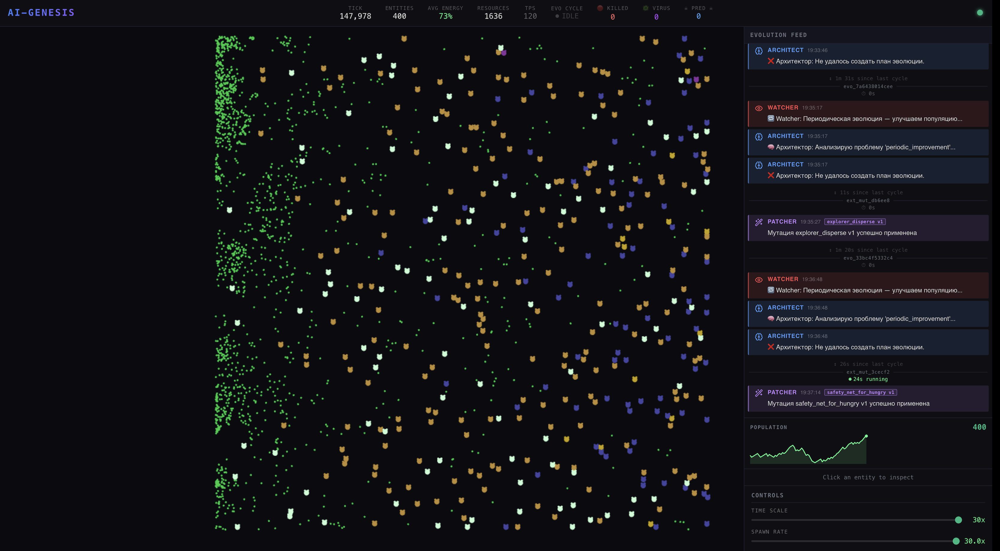

# AI-Genesis

Autonomous artificial life sandbox where digital entities (Molbots) evolve through
runtime code self‑modification driven by a local LLM.

The system runs a physics-based world, observes population health, and autonomously
generates Python trait classes that are hot-loaded into the live simulation — no restart
required.



---

## Project Goal

AI-Genesis aims to be a **24/7 self-evolving digital aquarium**:

- The world continuously runs a tick-based physics simulation with up to 500 Molbots.
- A pipeline of internal AI agents (Watcher, Architect, Coder, Patcher) monitors telemetry,
  designs evolution plans, generates new Python traits, and safely hot-reloads them.
- The human’s role is to **observe, tweak environment parameters, and study emergent behavior**, not to hand-code every rule.

For the detailed product vision and success metrics, see `docs/PRD.md` and `docs/goal.md`.

---

## Tech Stack

| Layer | Technology |
|-------|-----------|
| Backend | Python 3.11 · FastAPI · asyncio |
| Frontend | React 18 · PixiJS 8 · TypeScript |
| State & Events | Redis 7 (Pub/Sub + Streams) |
| LLM | Ollama (Llama 3 8B, local) |
| Infrastructure | Docker Compose |

More architectural details are in `docs/tech_stack.md`.

---

## Prerequisites

- Docker ≥ 24 and Docker Compose ≥ 2.20
- 16 GB RAM (Ollama needs ~8 GB for Llama 3 8B)
- 10 GB free disk (model weights)
- Internet access for the first run (model download ~4 GB)

---

## Quick Start

```bash
docker compose up --build
# then open in the browser:
#   http://localhost:3000
```

On first launch Ollama will download the Llama 3 8B model (~4 GB).  
The core service waits for Ollama to become healthy before starting.

Once all services are running:

| URL | Description |
|-----|-------------|
| http://localhost:3000 | Frontend — live world visualization |
| http://localhost:8000/docs | Swagger UI — REST API |
| http://localhost:8000/api/health | Health check |

---

## High-Level Architecture

See `docs/tech_stack.md` for the full architecture, data layer design, event bus protocol,
and sandbox security model.

```text
Browser (React + PixiJS)
        │  WebSocket (30 FPS binary frames)
        ▼
   Nginx :3000
        │  proxy
        ▼
   FastAPI :8000  ──────►  Redis (Pub/Sub + Streams)
        │                       ▲
        ▼                       │
   CoreEngine (tick loop)       │
   WatcherAgent ────────────────┘
   ArchitectAgent  ──►  Ollama :11434
   CoderAgent      ──►  Ollama :11434
   RuntimePatcher  ──►  DynamicRegistry (hot-reload)
```

Key backend directories:

- `backend/core` — simulation engine, entities, traits, physics, environment.
- `backend/agents` — Watcher, Architect, Coder, and mutation gatekeeper agents.
- `backend/sandbox` — validation, patching, and safe hot-reload of LLM-generated code.
- `backend/bus` — Redis-based event bus and event types.
- `backend/api` — FastAPI app, REST routes, and WebSocket handlers.

The **LLM-generated traits** live only in the `mutations/` directory and are validated by
the sandbox before being loaded into the running world.

---

## Key API Endpoints

```text
GET  /api/health              — Redis · Ollama · Core status
GET  /api/world/state         — Current tick, entity count, world params
GET  /api/stats               — Uptime, TPS, avg energy, mutations applied
POST /api/world/params        — Tune simulation parameters live
POST /api/evolution/trigger   — Force an evolution cycle manually
GET  /api/mutations           — List all generated trait mutations
GET  /api/entities/{id}       — Inspect a specific Molbot
```

---

## Verify the System

```bash
# Health check — all core services should be true
curl http://localhost:8000/api/health

# Current world state
curl http://localhost:8000/api/world/state

# Applied mutations (populated after the first evolution cycle)
curl http://localhost:8000/api/mutations
```

---

## Stopping & Persistence

```bash
docker compose down
```

Data persists in Docker volumes (`redis_data`, `ollama_models`).  
To reset completely:

```bash
docker compose down -v
```

---

## Keywords

#AI-Genesis #ArtificialLife #SelfModifyingCode #AutonomousAgents #LLM #Ollama
#Python #FastAPI #AsyncIO #Redis #Simulation #EmergentBehavior #React #TypeScript #PixiJS
